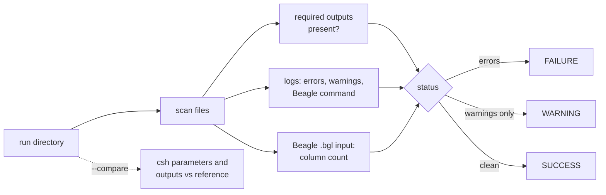

# HLA Imputation Analyst

[](https://github.com/dsugurtuna/hla-imputation-analyst/actions/workflows/ci.yml)

A health check for SNP2HLA / Beagle HLA imputation run directories: are the outputs there, what went wrong in the logs, and how does this run differ from one that worked?

> **Note:** This repository contains a sanitized, professionalized version of tools developed for high-throughput immunogenetics workflows at **NIHR BioResource**. It demonstrates modern software engineering practices including **Python package structure**, **Docker containerization**, **CI/CD**, and **automated testing**.

## The problem

When an SNP2HLA run fails, the evidence is spread across a Beagle log, a csh script and a folder of partly written files. Working out whether the run finished, why it stopped, and what changed since the last good run usually means reading logs by hand.

## What this does

- **Checks outputs.** Looks for SNP2HLA's final outputs (`.bgl.phased`, `.bgl.gprobs`, `.bgl.r2`, `.dosage`) and fails the run if any are missing. The `.MHC.*` intermediates are checked when present but not required, because SNP2HLA's default cleanup deletes them.
- **Reads logs.** Flags error lines (whole-word `error` or `exception`, `OutOfMemoryError`, `Segmentation fault`, `Killed`, but not `0 errors`) and warning lines, and pulls out the Beagle `java ... -jar ...` command if the log contains it.
- **Validates Beagle input.** A Beagle 3 file has two leading columns and two per sample, so an odd number of genotype columns is reported as an error.
- **Compares two runs.** Byte-compares `SNP2HLA.csh`, lists the `set` parameters that differ and names the outputs the reference run has that this one lacks.
- **Reports** to the console, or to a text, JSON or HTML file. `validate` exits 1 on failure for use in scripts.

## Quickstart

Uses the synthetic runs in [`data/`](data/README.md).

```bash
git clone https://github.com/dsugurtuna/hla-imputation-analyst.git
cd hla-imputation-analyst
python3.11 -m venv .venv && source .venv/bin/activate
pip install -e ".[dev]"
pytest

hla-analyst analyze data/sample_batch
hla-analyst analyze data/failed_batch --compare data/sample_batch
hla-analyst analyze data/sample_batch --format html --output report.html
hla-analyst validate data/failed_batch || echo "run failed its checks"
```

The comparison prints, among other lines:

```text
Status: FAILURE
Required outputs found: 1/4
  error   demo.bgl.log:3 - Exception in thread "main" java.lang.OutOfMemoryError: Java heap space
Compared with reference: sample_batch
  SNP2HLA.csh: different
  set WIN: this=500 reference=1000
  missing here but present in reference: *.dosage
```

From Python:

```python
from hla_analyst.core import BatchAnalyzer

metrics = BatchAnalyzer("data/failed_batch").analyze()
print(metrics.status.value, metrics.missing_artifacts)
```

A `Dockerfile` is included (`docker build -t hla-analyst .`, then `docker run --rm -v "$PWD/data:/data" hla-analyst analyze /data/sample_batch`). It is not built in CI, so treat it as untested.

## How it works



| Module | Role |
| :--- | :--- |
| `core.py` | Scanning, checks, status and comparison |
| `parsers.py` | Beagle command and csh `set` parsing |
| `models.py` | Pydantic result models (also the JSON schema) |
| `report.py` | Text, JSON and HTML output |
| `cli.py` | `analyze` and `validate` commands |

## Design decisions

- **Final outputs, not intermediates, decide success.** The check follows what SNP2HLA leaves behind after its own cleanup, so a correct run is never reported as incomplete.
- **Missing outputs are errors, not warnings.** A run without `.dosage` cannot be delivered, so `validate` must fail it.
- **Error matching is narrow on purpose.** Whole words and a short list of known fatal messages, with `0 errors` excluded. A broad substring match produced false alarms.
- **Compare against a known-good run.** Most failures come from a changed parameter or a missing input, and a diff against a run that worked finds them faster than reading logs.
- **`analyze` reports, `validate` gates.** `analyze` always exits 0 so it can be used interactively; `validate` exits 1 on failure (2 if the directory is missing) for pipelines.
- **HTML output is autoescaped** because log lines are copied into the page.
- **Four runtime dependencies** (Typer, Rich, Pydantic, Jinja2) and no network access. Earlier versions declared HTTP and data-frame libraries the code never used.

## Limitations and what it is not

- It checks structure and logs, not imputation accuracy. Use `.bgl.r2` values and typed validation samples for that.
- Finding the Beagle command depends on it appearing in the log; SNP2HLA does not always write it there.
- It understands SNP2HLA's file naming, not CookHLA, HIBAG or Minimac output.
- Output files are checked for presence, not content (an empty `.dosage` counts as present).
- `legacy/analyze_imputation_batch.sh` is the original shell version, kept for reference and not maintained.

## Where this fits

Diagnoses runs produced by [hla-pipeline-manager](https://github.com/dsugurtuna/hla-pipeline-manager), which also checks outputs before deployment. For marker-level checks after imputation, see [hla-variant-investigator](https://github.com/dsugurtuna/hla-variant-investigator).

## Roadmap

- Report per-marker `.bgl.r2` summaries (how many HLA alleles fall below a threshold).
- Check that output sample counts match the input `.fam`.
- Support CookHLA output names.

## Licence

MIT. See [LICENSE](LICENSE).

---

Personal project by [Ugur Tuna](https://github.com/dsugurtuna). Not affiliated with or endorsed by any employer.
